# Hello Ising 2D

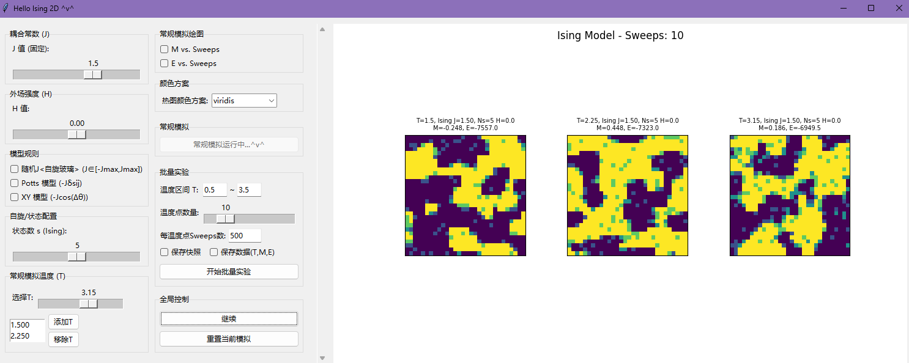

## 项目功能

* **可支持的模型**
    * **伊辛模型 (Ising-like)**：可自定义自旋状态数 Ns（注意，这里的标度模式是经典的 Ns=2 对应 s = +/-0.5 ，Ns=3 对应 s = {-1, 0, 1} ...）
    * **随机J模型 (类自旋玻璃)**：耦合常数 Jij 从对称分布 U[-Jmax, Jmax] 中随机抽取并固定，模拟无序系统中的阻挫效应
    * **Potts 模型**：相互作用能量取决于相邻自旋是否处于相同状态 (E propto -J * delta(si, sj))。状态数 q (即 Ns) 可调
    * **XY 模型**：自旋被视为在二维平面上可以自由旋转的单位向量（用角度 theta in [0, 2*pi) 表示），相互作用为 E propto -J * cos(theta_i - theta_j)
    * 所有模拟均基于 **Metropolis Monte Carlo算法** 进行
* **可交互调节参数**
    * 耦合常数 J (或随机J的幅度上限 Jmax)
    * 自旋状态数 Ns (或Potts模型的 q 值)
    * 外场强度 H
    * 温度 T
    * 热图/箭头图的颜色方案
* **动态演化可视化**
    * 实时显示晶格的自旋构型（Ising/Potts为热图，XY为箭头图）
    * 可选择同时绘制系统的平均磁化强度 M 和总能量 E 随Monte Carlo步数（sweeps）演化的曲线
* **常规模拟(多温度并行观察)**
    * 可以手动添加一个或多个离散的温度值。
    * 程序会同时对这些选定的温度运行模拟（每个温度一个独立的模型实例），并在同一绘图窗口中并列展示它们各自的演化过程（热图/箭头图以及可选的M-sweeps, E-sweeps曲线）。
* **批量实验（扫描温度）**
    * 可以设定一个温度区间 (Tmin, Tmax) 和在该区间内的取点数目。
    * 程序将从 Tmax **降温**到 Tmin，依次对每个温度点进行模拟（每个温度点运行指定的sweeps数，例如500 sweeps）。
    * **动态更新**：
        * 左侧绘图区：显示当前正在处理的温度点在完成其所有sweeps后的**最终自旋构型**。当切换到下一个温度点时，此图会更新。
        * 右侧绘图区：动态绘制**最终磁化强度 Mfinal vs. 温度 T** 和 **最终能量 Efinal vs. 温度 T** 的曲线。随着每个温度点的模拟完成，新的数据点会被添加到这两条曲线上。
    * 此模式更侧重于观察系统物理量随温度的整体变化趋势（例如寻找相变点），而非每个温度内部的详细演化过程（中间sweeps不逐帧显示，以提高性能）。
* **数据与图像保存**
    * 在批量实验模式下，可以选择：
        * **保存快照**：在每个温度点的模拟结束后，将包含最终热图/箭头图以及（到目前为止的）M(T)、E(T)曲线的整个绘图窗口保存为图像文件（PNG格式）
        * **保存数据**：在整个批量实验完成后，将所有温度点对应的最终温度T、磁化强度M和能量E以CSV格式保存到数据文件中
    * 默认保存路径为项目根目录下的 `logs_picture/`（快照）和 `logs_data/`（数据文件）。文件名会自动包含模型类型、J、Ns、H等参数以及模拟ID和温度（快照时）等信息

## 使用方法

> 非常好上手 ！ QvQ

1.  **启动应用**：运行 `main.py` 文件。
2.  **参数设置**：
    * 在GUI左侧的控制面板中，通过滑块和输入框设置 J 值、外场 H、Ns（Ising/Potts状态数）等
    * 选择是否启用“随机J”、“Potts模型”或“XY模型”。这些选项通常可以叠加使用（例如，随机J的XY模型）
        * **注意**：当“XY模型”被勾选时，“Potts模型”选项和“状态数 Ns”滑块将被禁用，因为XY模型的自旋由角度描述，其相互作用规则也与Potts模型不同
    * 如果模拟的不是XY模型（即Ising或Potts模型），可以从下拉菜单中选择热图的颜色方案
    * 勾选是否要在常规模拟或批量实验的M(T)/E(T)图中显示磁化强度和能量曲线。
3.  **选择模拟模式**：
    * **常规模拟（多温度并行观察）**：
        * 在“常规模拟温度(T)”区域，使用滑块选择一个温度，然后点击“添加T”按钮将其加入列表。重复此操作添加多个温度
        * 设置完毕后，点击“开始常规模拟”按钮。模拟将在右側绘图区动态展示
    * **批量实验（扫描温度获取M(T), E(T)）**:
        * 在GUI最下方的“批量实验”区域进行设置。
        * 在“温度区间T”输入框中设置扫描的最低和最高温度（左控制列的温度列表无效）
        * 通过“温度点数量”滑块设置在此区间内要模拟的温度点个数
        * 在“每温度点Sweeps数”输入框设置每个温度点要运行的Monte Carlo步数
        * 勾选是否“保存快照”和/或“保存数据文件”
        * 点击“开始批量实验”

## 注意事项

* **GUI响应与暂停**：当模拟正在密集计算和绘图时，如果需要进行其他GUI操作（如调整参数准备下一次模拟），建议先点击“暂停”按钮，以避免潜在的GUI卡顿或显示问题
* **常规模拟的温度数量**：同时模拟的温度点不宜过多（例如，超过3-4个），否则绘图区域会显得拥挤，且可能因并行计算（逻辑上的并行，实际是分时更新）和绘图过多而降低整体流畅性
* **窗口大小调整**：如果子图布局显得不美观（例如，标题重叠、图像被压缩），可以尝试调整整个应用程序窗口的大小，进行Matplotlib的布局的自适应
* **终端/控制台输出**：请注意查看运行该脚本的控制台，它会显示当前的模拟进度、状态信息以及可能的警告或错误
* 
   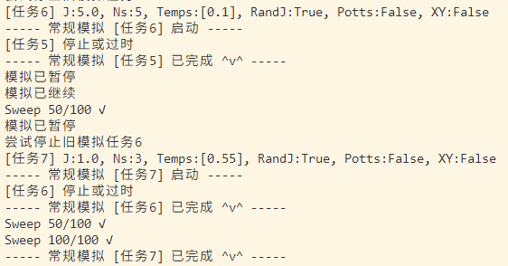

* **参数修改**：一些固定的默认参数（如晶格大小 `L_val`、默认的总`sweeps`数、J和s滑块的范围等）可以直接在 `ising_app.py` 文件的 `IsingApp`类的 `__init__` 方法中修改。
* **M(T), E(T) 曲线的X轴**：在批量实验中，M(T)和E(T)曲线的温度轴（X轴）是**按照实际扫描顺序（从高温到低温）动态添加数据点并连接的**,这样可以更形象地展示从无序到有序（寻找临界温度 Tc）的过程 。但在最终显示和保存数据到CSV文件时，数据点会按照**温度从低到高**的顺序排列，这更符合相图的常规表示方法

## 模拟示例与效果

* 常规Ising模型（Ns = 2，J=1，H=0）：

    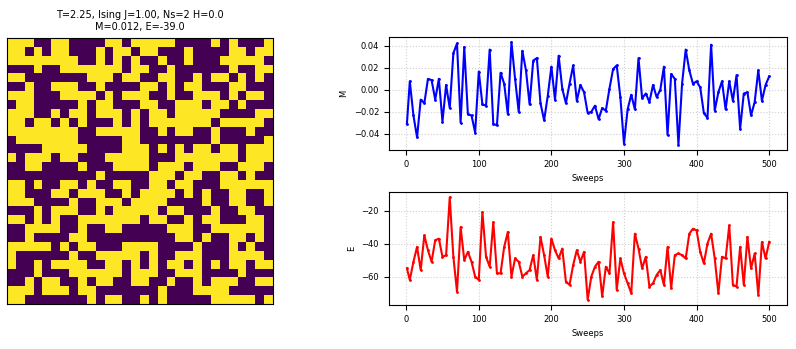

* 当 Ns > 2 时，系统的“抱团”成畴（domain formation）特征可能比常规Ising模型（Ns=2）更明显（尤其是在低温下）：

    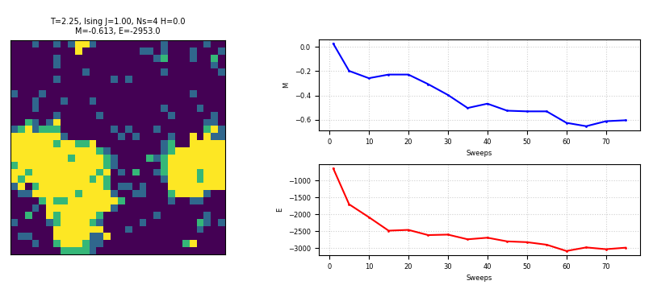

* 耦合常数 J 增大时也是如此。系统的有序化倾向更强，畴壁更清晰（或在相同温度下更有序）：

    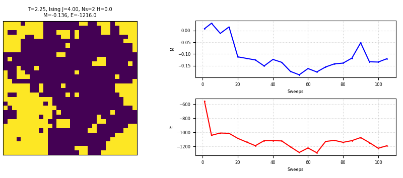

* 我们来看当J为超级负值时系统的超级反铁磁耦合性质：

    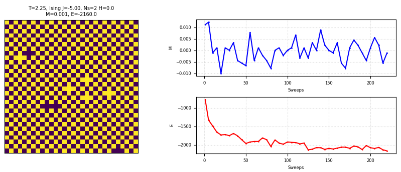

* 当外场 H != 0 时，无论温度如何，系统的整体磁化方向总会受到 H 的影响，倾向于与 H 同向：

    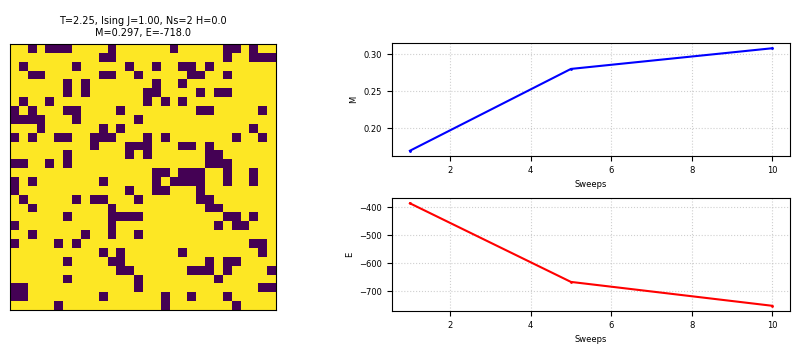

* 当使用XY模型时，自旋由箭头角度来表示，映射到颜色以辅助直观理解：

    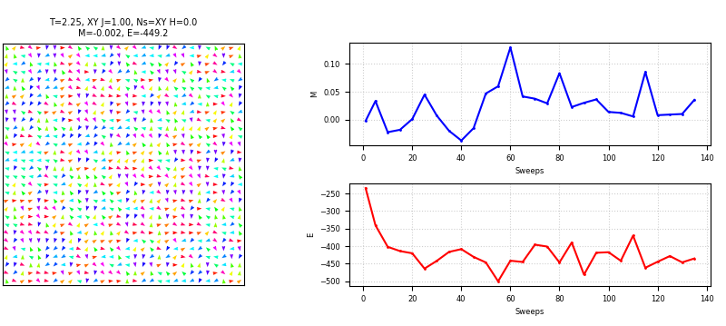

    有外场影响时：

    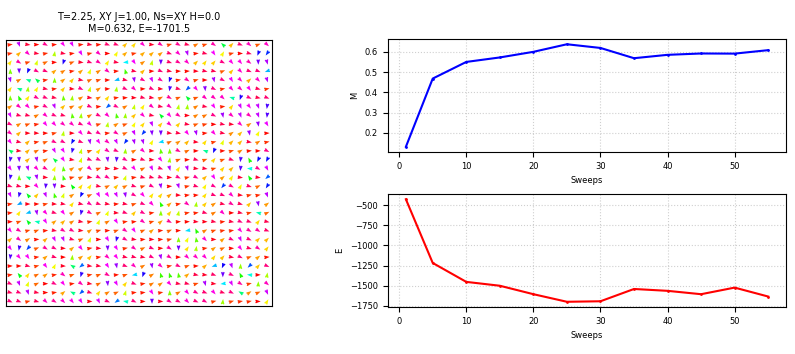

* 通过批量实验扫描温度区间，可以帮助我们定位系统发生相变的临界温度 Tc 大致在哪个范围（粗调）。 例如，我们观察到序参量 M（或其绝对值）在温度从 T=1.0 逐渐降低到 T=0.5 的过程中，其绝对值发生了剧烈的增大。

    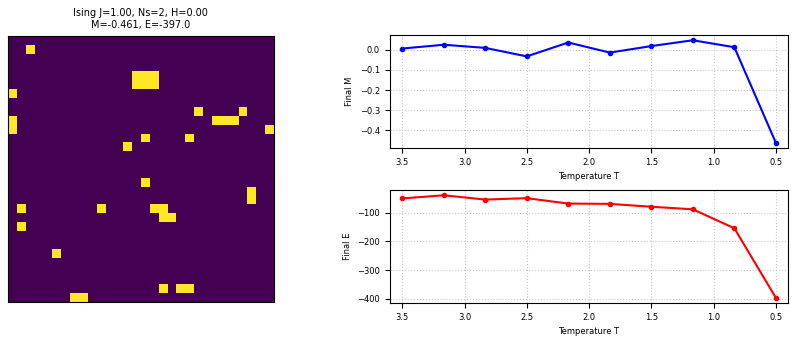

* 这提示我们可以在这个区间附近进行更精细的批量实验（更密的温度点）来更准确地定位 Tc：

    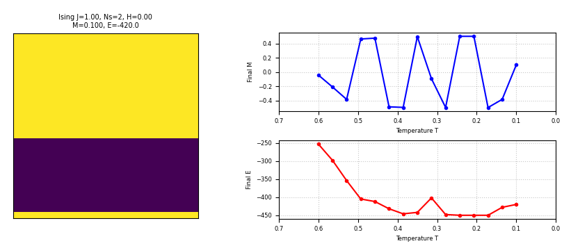

    可以发现确实在 T=0.5 的时候，在300个sweep下，系统已经可以收敛到约为 M=0.5 的状态。
    * 理论上，对于二维标量Ising模型（s = +/-1），其精确解给出的临界温度是 Tc = (2*J) / (kB * ln(1+sqrt(2))) ≈ 2.269 * J/kB。如果我们的模型自旋态是 s = +/-0.5，那么相互作用能 Eij = -J * si * sj 可以等效为一个耦合常数为 J' = J/4 的 s' = +/-1 模型。因此，等效的临界温度将是 Tc ≈ 2.269 * (J/4) / kB。如果 J=1, kB=1，则 Tc ≈ 0.567，与我们模拟观察到的 M 值在 0.5 附近发生剧变的结果确实大致相符！

    > **特别地**：上图结果是一个典型的亚稳态构型。由于Metropolis算法是基于马尔可夫链蒙特卡洛的随机抽样过程，系统有时可能会在演化过程中陷入能量的**局部最优解**，而不是全局能量最低的基态，尤其是在低温或存在能量势垒时。可以通过更长的模拟时间、更优的初态选择或使用更高级的算法（如模拟退火、并行回火等）来优化。

* 如果选择了“保存快照”或“保存数据”，相应的文件会保存在程序运行目录下的 `logs_picture/` 和 `logs_data/` 文件夹中：

    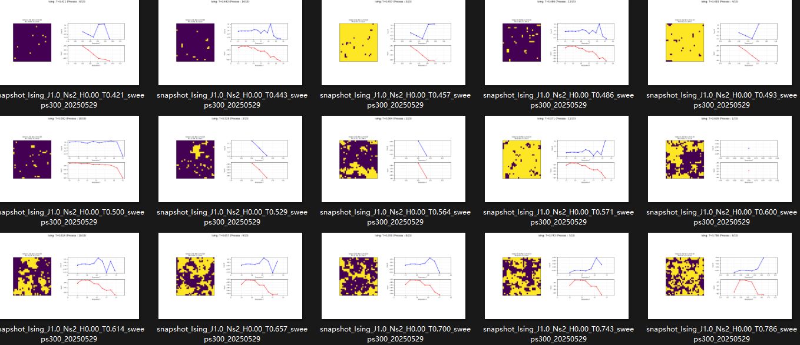

    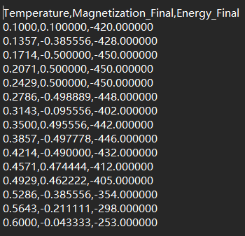

## 更多示例

最后，这是一个课程作业，[这是作业pdf链接](./sources/notebook.pdf)，包含更详细的模拟示例与分析。

作者只是兴趣性地完成这个项目，没有对严谨程度和学术程度做任何要求

又及，批量实验的代码实际上可以设计成并行计算，也就是将每个温度点设计成一个独立线程进行计算，线程间设置一定时间差值以展示曲线的动态演化，这样会比现在单线程进行批量实验的效率高很多；或许还可以量化接近Tc时的关联长度，与分形联系等等特征？...作者心情无比大好的时候可能会填这个坑-v-

## License

This project is licensed under the MIT License - see the [LICENSE.md](LICENSE.md) file for details.